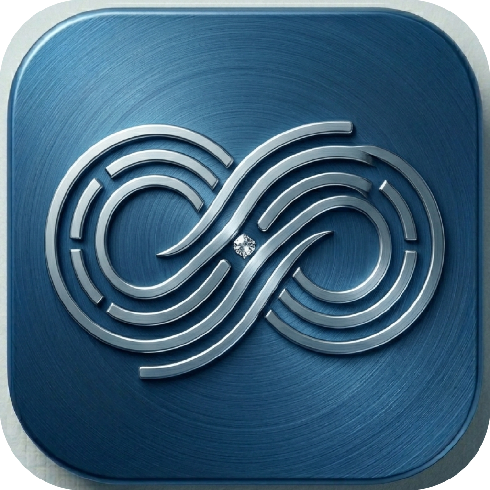
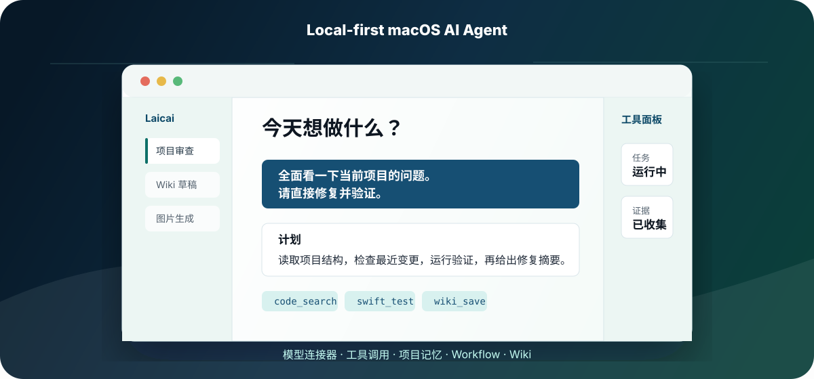

# 来财 Laicai

<p align="center">
  
</p>

<h3 align="center">macOS 原生 AI Agent，运行在本机，拥有完整工具链。</h3>

<p align="center">
  <a href="https://github.com/Hunterleeeee/laicai/actions/workflows/swift.yml"></a>
  <a href="https://github.com/Hunterleeeee/laicai/releases/latest"></a>
  <a href="LICENSE"></a>
  <a href="https://hunterleeeee.github.io/laicai/"></a>
  <a href="https://github.com/Hunterleeeee/laicai/stargazers"></a>
</p>

<p align="center">
  <a href="https://github.com/Hunterleeeee/laicai/releases/latest"><strong>下载 DMG</strong></a>
  ·
  <a href="https://hunterleeeee.github.io/laicai/">产品官网</a>
  ·
  <a href="https://github.com/Hunterleeeee/laicai/stargazers">给项目 Star</a>
</p>

来财是一个本地优先的 macOS AI 工作台。它把模型连接器、工具调用、项目记忆、工作流和 Wiki 放在一个原生应用里，让 AI 不只是聊天，而是能读项目、跑工具、做验证、沉淀知识。

> 当前公开版本适合本地开发、验证和自构建发布。DMG 暂未 Apple notarize，首次打开可能需要在 macOS「隐私与安全性」里允许。

<p align="center">
  
</p>

## 一眼看懂

| 你想做什么 | 来财怎么帮你 |
| --- | --- |
| 审查一个项目 | 读取项目结构、搜索代码、检查 diff、输出问题和修复建议 |
| 执行一个任务 | 自动规划、调用工具、验证结果，并在失败时继续修复 |
| 沉淀知识 | 把结果保存到 Wiki / Obsidian Vault / 项目记忆 |
| 切换模型 | 支持 OpenAI、Anthropic、DeepSeek、Ollama 等连接器 |
| 做重复流程 | 用 skill 和 workflow 编排常用任务 |

## 核心能力

| 能力 | 说明 |
| --- | --- |
| 多连接器 | OpenAI / Anthropic / DeepSeek / Ollama，一键切换 |
| Agent Loop | 自动规划 -> 工具调用 -> 验证 -> 修复循环 |
| 工具系统 | 文件读写、代码搜索、Shell、联网搜索、Wiki、图片生成 |
| 本地记忆 | 持久化项目记忆，支持 Obsidian Vault 集成 |
| 工作流 | 内置 skill/workflow，可扩展、可复用 |
| 自我进化 | 记录失败模式、提示词实验和经验沉淀 |

## 下载和安装

1. 打开 [最新 Release](https://github.com/Hunterleeeee/laicai/releases/latest)。
2. 下载 `Laicai-<version>-<build>.dmg`。
3. 把 `Laicai.app` 拖到 Applications。
4. 第一次启动后，添加或选择你的模型连接器。

Release 包不包含作者的个人配置、API key、聊天历史或 connector。用户数据会在每台机器首次运行后独立生成，默认目录是：

```text
~/Library/Application Support/Laicai
```

## 从源码运行

环境要求：

- macOS 14 或更新版本
- Xcode 15 或更新版本
- Swift 5.9 或更新版本

检查本机工具链：

```bash
bash scripts/check-macos-toolchain.sh
```

构建应用和 CLI：

```bash
bash native-macos/build.sh
```

生成 DMG：

```bash
bash native-macos/package-dmg.sh
```

只构建当前架构，适合本机快速出包：

```bash
LAICAI_ARCHS=arm64 bash native-macos/package-dmg.sh
```

跳过重新构建，直接用现有 app/CLI 打包：

```bash
LAICAI_SKIP_BUILD=1 bash native-macos/package-dmg.sh
```

SwiftPM 入口：

```bash
cd native-macos
swift run LaicaiNativeApp
swift run laicai --help
```

本地输出位置：

```text
native-macos/dist/             # app / CLI 构建产物
outputs/Laicai-*.dmg           # 最终 DMG
```

## 验证

```bash
bash scripts/check-project-hygiene.sh
bash scripts/check-swift-file-sizes.sh
python3 scripts/validate-skills.py
swift test --package-path native-macos
```

风格检查脚本也保留在仓库中：

```bash
bash scripts/lint-swift.sh
```

当前 SwiftLint/format 仍有存量问题，适合作为后续代码精简和风格债清理入口。

## 项目结构

```text
native-macos/Sources/
  LaicaiNativeApp/        # 应用入口
  LaicaiNativeDomain/     # 数据模型
  LaicaiNativeFoundation/ # Agent、工具、连接器、记忆
  LaicaiNativeUI/         # SwiftUI 界面
  LaicaiNativeCLI/        # CLI 工具
skills/                   # 可扩展技能定义
docs/                     # 架构、验证、发布和 skill 文档
assets/                   # 图标资源
site/                     # GitHub Pages 产品页
outputs/                  # 本地打包输出
```

## 文档

- [项目架构](docs/architecture.md)
- [验证和打包](docs/verification.md)
- [开源发布与传播](docs/launch.md)
- [Skill 结构](docs/skills.md)
- [品牌与图标](docs/branding.md)

## 开源参与

来财以 MIT License 开源。欢迎 fork、提 issue、提 PR，也欢迎给项目一个 Star，让更多人看到这个本地优先的 macOS AI Agent。

- 许可证：[MIT](LICENSE)
- 贡献方式：[CONTRIBUTING.md](CONTRIBUTING.md)
- 安全问题：[SECURITY.md](SECURITY.md)
